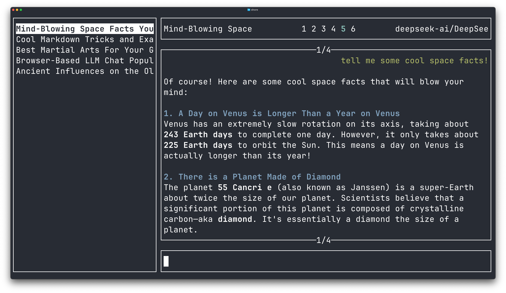

# Shore

Shore is a terminal based chatbot interface that is simultaneously minimalist, productive, and aesthetically pleasing. [Read the docs](https://moonkraken.github.io/shore/gettingstarted/about/)

Conversations are stored locally in a SQLite database, by default in `~/.shore/default.db`

## Installation
1. `cargo install shore`
1. Set **at least** one API key - `HF_TOKEN`, `OPENAI_API_KEY`, `ANTHROPIC_API_KEY`, `GROQ_API_KEY`, `XAI_API_KEY`, `SONAR_API_KEY` 
1. Review [Keybindings](https://moonkraken.github.io/shore/keybindings/01-overview/)